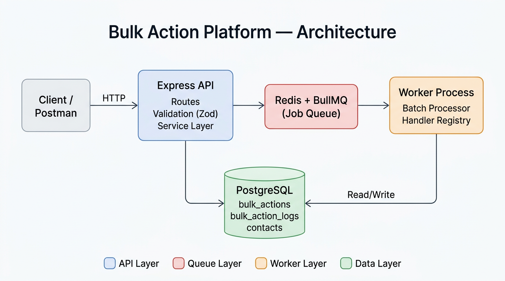
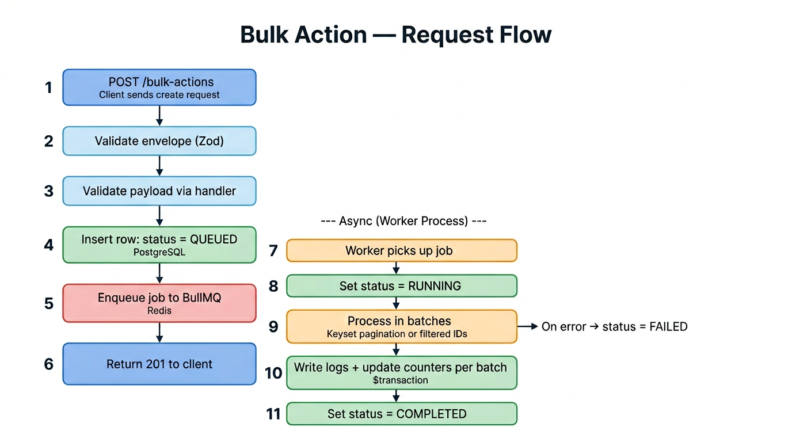
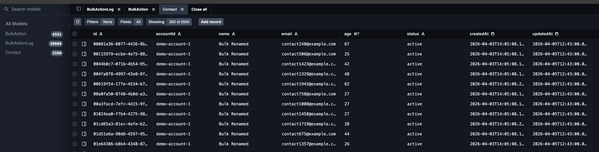
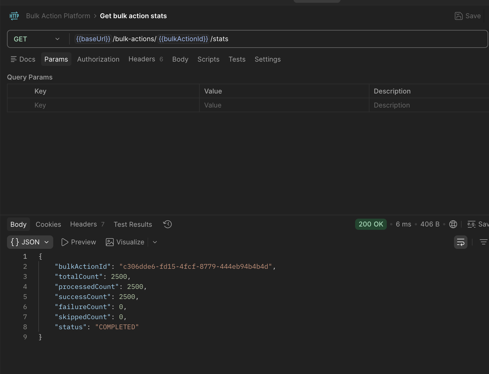
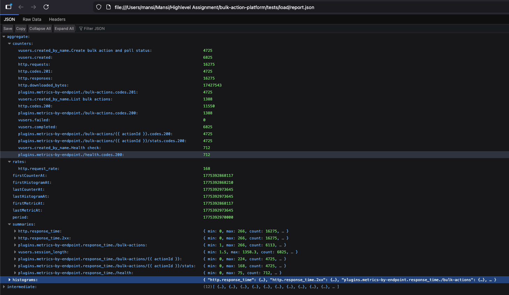
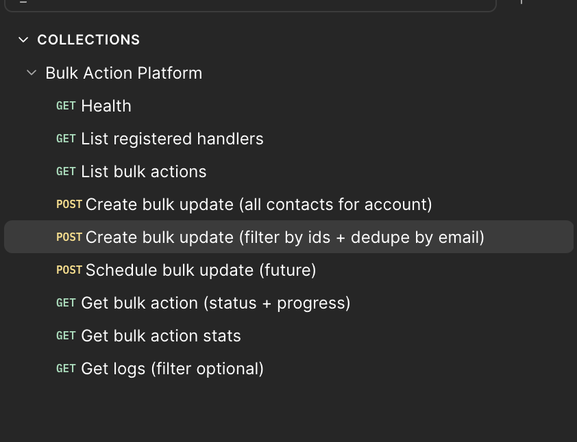

# Bulk Action Platform

A scalable bulk action engine for CRM entities. Submit a request, get a job ID back instantly, and let the platform process thousands of entity updates asynchronously with real-time progress tracking, per-entity audit logs, per-account rate limiting, and scheduled execution.

> **Loom Video walkthrough** 
  [High level design demo](https://www.loom.com/share/a35a131a6dbd46d8affad795b9f3cc14) and 
  [Endpoint demo](https://www.loom.com/share/468ef46e520c48b49b15ffcb0f0d6704)

> **Architecture deep-dive & design decisions** → [TECH_DESIGN.md](./docs/TECH_DESIGN.md)
>
> **Load test report (Artillery)** → [LOAD_TEST.md](./docs/LOAD_TEST.md)

---

## Architecture



The system is split into **two separate processes** — the **API server** (accepts and validates requests, enqueues jobs) and the **Worker** (pulls jobs from the queue and processes entities in batches). They share PostgreSQL and Redis, so either can be scaled independently.

---

## Key Features

| Feature | What it does |
|---------|-------------|
| **Async Bulk Processing** | `POST /bulk-actions` returns `201 { id }` instantly. Entities are processed in a background worker with real-time progress, per-entity audit logs (`SUCCESS` / `FAILED` / `SKIPPED`), at-least-once delivery, and automatic retries. |
| **Entity-Agnostic** | Not hardcoded to contacts. A handler registry maps `(actionType, entityType)` → handler. Add a new bulk action (e.g. `bulk_tag:deal`) by implementing one interface and registering it — zero changes to routes, queue, or processor. |
| **Batch Processing + Keyset Pagination** | Processes entities in configurable batches (default 500) using cursor-based pagination — O(1) per page regardless of table size. Supports full-account scans and filtered ID subsets. |
| **Scheduled Execution** | Pass `scheduledAt` (ISO 8601) to defer a job. BullMQ holds it in `delayed` state and promotes it automatically — no cron service needed. |
| **Per-Account Rate Limiting** | Redis Lua script caps each account at 10,000 ops/min. On limit hit the job pauses and retries with exponential backoff — not marked as failed. |

> Design rationale, handler interface, DB schema decisions, and scaling strategy → [TECH_DESIGN.md](./docs/TECH_DESIGN.md)

---

## Request Flow



**Left column** — synchronous API path (steps 1–6, typically < 50 ms):  
Validate → check handler exists → persist job row → enqueue to Redis → return 201.

**Right column** — asynchronous worker path (steps 7–11):  
Dequeue → process in batches → write logs + update counters atomically → mark completed.

---

## Tech Stack

| Layer | Technology | Why |
|-------|-----------|-----|
| Runtime | Node.js 20+ / TypeScript | Type safety, async I/O |
| API | Express | Mature, minimal overhead |
| Queue | BullMQ + Redis | Delayed jobs, retries, at-least-once delivery |
| Database | PostgreSQL 16 (Prisma ORM) | ACID transactions for log + counter atomicity |
| Validation | Zod | Runtime validation + TypeScript inference |
| Logging | Winston | Structured JSON logs in production |

---

## Quick Start

**Prerequisites:** Node.js >= 20 and Docker.

```bash
# 1. Clone the repository
git clone https://github.com/mansisisangiya/bulk-action-platform.git
cd bulk-action-platform

# 2. Install dependencies
npm install

# 3. Start PostgreSQL + Redis
docker compose up -d

# 4. Copy environment file (defaults work out of the box)
cp .env.example .env

# 5. Run migrations and seed ~2,500 demo contacts
npm run db:migrate
npm run db:seed

# 6. Start API server (Terminal 1)
npm run dev

# 7. Start background worker (Terminal 2)
npm run dev:worker
```

API is available at `http://localhost:3000`.

---

## Database Schema

Three tables power the platform — inspectable via `npm run db:studio` (Prisma Studio):



| Table | Purpose |
|-------|---------|
| `bulk_actions` | Job metadata, status lifecycle, denormalized counters |
| `bulk_action_logs` | Per-entity audit trail (one row per entity per job) |
| `contacts` | Sample CRM entity for the `bulk_update:contact` handler |

---

## API Reference

| Method | Path | Description |
|--------|------|-------------|
| `GET` | `/health` | Health check + queue depth |
| `POST` | `/bulk-actions` | Create a bulk action |
| `GET` | `/bulk-actions` | List all bulk actions |
| `GET` | `/bulk-actions/:id` | Get status + real-time progress |
| `GET` | `/bulk-actions/:id/stats` | Success/failure/skipped counts |
| `GET` | `/bulk-actions/:id/logs` | Per-entity audit logs (paginated, filterable) |
| `GET` | `/bulk-actions/meta/handlers` | List registered action handlers |

### Create a Bulk Action

```bash
curl -X POST http://localhost:3000/bulk-actions \
  -H "Content-Type: application/json" \
  -d '{
    "accountId": "demo-account-1",
    "actionType": "bulk_update",
    "entityType": "contact",
    "payload": {
      "updates": { "status": "active" }
    }
  }'
```

### Update Specific Contacts Only

Pass `filter.ids` to target a subset:

```json
{
  "accountId": "demo-account-1",
  "actionType": "bulk_update",
  "entityType": "contact",
  "payload": {
    "updates": { "name": "Renamed" },
    "filter": { "ids": ["uuid-1", "uuid-2"] }
  }
}
```

**Schedule for a future time** (pass `scheduledAt` in ISO 8601):

```json
{
  "accountId": "demo-account-1",
  "actionType": "bulk_update",
  "entityType": "contact",
  "scheduledAt": "2025-11-22T23:15:00.000Z",
  "payload": { "updates": { "status": "inactive" } }
}
```

### Poll Progress

```bash
curl http://localhost:3000/bulk-actions/<id>
# returns: { "status": "RUNNING", "progress": 0.42, ... }
```

### Get Stats

```bash
curl http://localhost:3000/bulk-actions/<id>/stats
```



### Get Per-Entity Logs

```bash
# Filter by status: SUCCESS | FAILED | SKIPPED
curl "http://localhost:3000/bulk-actions/<id>/logs?status=FAILED&limit=50"
```

---

## Load Testing

The API tier was load-tested with [Artillery](https://www.artillery.io/) using warm-up, sustained, and spike traffic phases.

| Metric | Value |
|--------|-------|
| Total HTTP requests | **16,275** |
| Virtual users completed | **6,825** |
| Error rate | **0%** |
| Peak request rate | **480 req/s** |
| p50 latency | **2 ms** |
| p99 latency | **30.3 ms** |



**Detailed breakdown, per-endpoint latencies, and phase-by-phase analysis** → [LOAD_TEST.md](./docs/LOAD_TEST.md)

### Reproduce the Load Test

```bash
# Seed data + start API and worker, then:
npm run load:test

# Generate an HTML report:
npm run load:test:report
```

---

## Postman Collection

Import `postman/Bulk-Action-Platform.postman_collection.json` into Postman. All endpoints are pre-configured with example payloads.



---

## Project Structure

```
src/
├── index.ts                        # API server entry point
├── worker.ts                       # BullMQ worker entry point
├── config.ts                       # Environment config (port, batch size, rate limit)
├── constants.ts                    # Shared constants
├── error.ts                        # Express error-handling middleware
├── handlers/
│   ├── types.ts                    # BulkActionHandler interface
│   ├── registry.ts                 # Handler lookup by (actionType, entityType)
│   └── bulkUpdateContact.ts        # bulk_update:contact — smart update strategy
├── controllers/
│   └── BulkActionController.ts     # Route handlers
├── middleware/
│   └── requestLogger.ts            # Request timing logs (Winston)
├── repositories/
│   └── EntityRepository.ts         # DB access abstraction for entity types
├── lib/
│   ├── prisma.ts                   # PrismaClient singleton
│   └── redis.ts                    # Redis singleton
├── queue/
│   └── bulkQueue.ts                # BullMQ queue setup + enqueue helper
├── routes/
│   └── bulkActions.ts              # Express routes
├── services/
│   ├── bulkActionService.ts        # Create, list, get, stats, logs
│   ├── bulkActionProcessor.ts      # Core batch processing engine
│   └── rateLimit.ts                # Redis Lua script — atomic per-account limiter
└── utils/
    └── logger.ts                   # Winston → console (JSON in production)

tests/
├── unit/                           # Vitest unit tests
│   ├── bulkUpdateContact.processBatch.test.ts
│   ├── bulkUpdateContact.validatePayload.test.ts
│   └── registry.test.ts
└── load/                           # Artillery load test config + results
    ├── bulk-action.yml
    └── report.json
```

---

## Available Scripts

| Script | Description |
|--------|-------------|
| `npm run dev` | Start API server with hot reload |
| `npm run dev:worker` | Start worker with hot reload |
| `npm run build` | Compile TypeScript to `dist/` |
| `npm start` | Run compiled API server |
| `npm run start:worker` | Run compiled worker |
| `npm run db:migrate` | Run Prisma migrations |
| `npm run db:seed` | Seed 2,500 demo contacts |
| `npm run db:studio` | Open Prisma Studio (DB browser) |
| `npm test` | Run unit tests (Vitest) |
| `npm run load:test` | Run Artillery load test |
| `npm run load:test:report` | Run load test + generate HTML report |

---

## Environment Variables

| Variable | Default | Description |
|----------|---------|-------------|
| `PORT` | `3000` | API server port |
| `DATABASE_URL` | — | PostgreSQL connection string |
| `REDIS_URL` | `redis://localhost:6379` | Redis connection string |
| `RATE_LIMIT_PER_MINUTE` | `10000` | Max entity operations per account per UTC minute (0 = disabled) |
| `WORKER_CONCURRENCY` | `4` | Parallel jobs per worker process |
| `NODE_ENV` | `development` | `development` or `production` |

---

## Scaling Strategy

### Horizontal Worker Scaling

```
Redis Queue
    │
    ├─► Worker Replica 1  (concurrency=4)
    ├─► Worker Replica 2  (concurrency=4)
    └─► Worker Replica N  (concurrency=4)
```

BullMQ assigns each job to exactly one worker. Start more worker processes (same `REDIS_URL`) to add throughput. The `/health` endpoint exposes queue depth for HPA / KEDA autoscaling.

### Production Path

| Concern | Mitigation |
|---------|-----------|
| DB write contention | PgBouncer connection pooling + read replicas |
| Redis SPOF | Redis Sentinel (failover) or Cluster (scale) — no code changes |
| Queue depth monitoring | `/health` returns `queue.waiting` + `queue.delayed` |

---

## Running Tests

```bash
npm test
```
